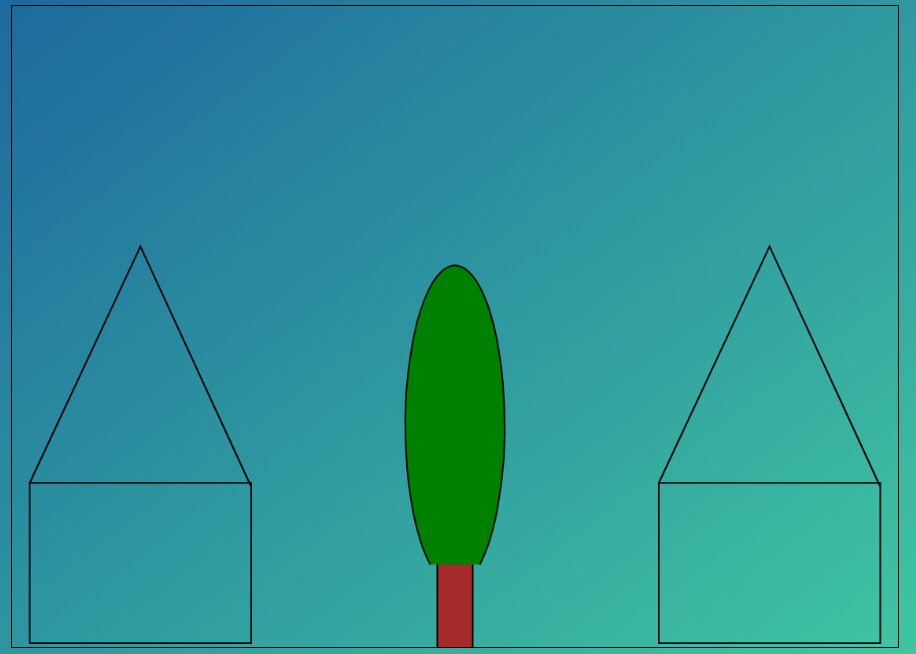
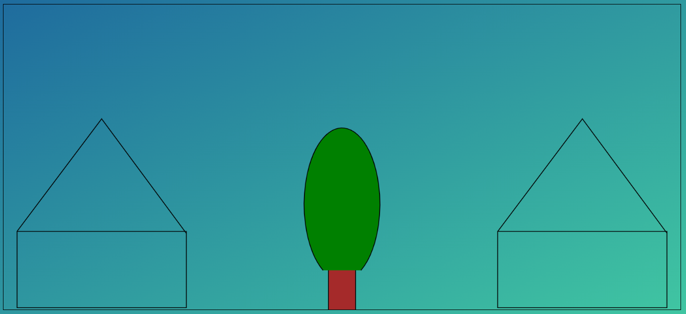

# Uppgift

I denna uppgift ska du använda Canvas och JavaScript för att skapa en bild enligt nedan. Du hittar startfilerna i denna repo.

De objekt som är använda är rektanglar ([se denna sida](https://www.w3schools.com/tags/canvas_rect.asp)), linjer ([se denn sida](https://www.w3schools.com/tags/canvas_lineto.asp)) och ellips ([se denna sida](https://developer.mozilla.org/en-US/docs/Web/API/CanvasRenderingContext2D/ellipse)).

Som synes på skärmdumparna ovan så ska du sträva efter att objekten ska spridas ut på hela bredden och ungefär halva höjden, oavsett vilket bredd- höjdförhållandet är på webbläsarfönstret. Det syn t ex att huset blir högre när fönstrets höjd ökar (och sidan uppdateras). I filen `script.js` ovan så finns det konstanter som hittar mitten på bilden, det (eller snarare kanske den metoden) kan du ha hjälp av när du bilden konstrueras. Andra exempel finns i repon [canvas-2022](https://github.com/nika-edu/canvas-2022).

Denna repo ska klonas till ditt GitHub-konto och din lösning ska pushas dit. Uppgiften ska vara slutförd (och naturligtvis pushad) senast tisdagen den 5 april.

Lycka till :-)